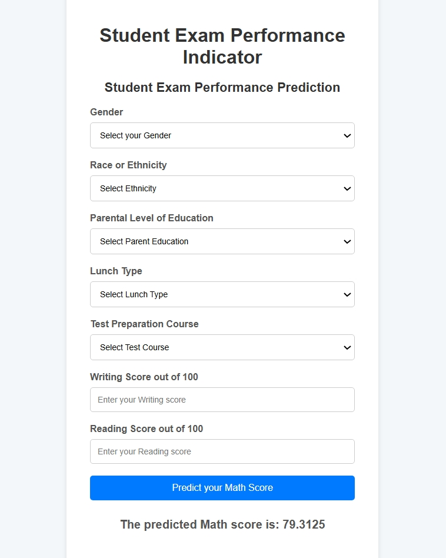

# 📌 Math Score Prediction Model




## 📖 Overview
This project is a Machine Learning model that predicts students' math scores based on various characteristics such as gender, parental education level, lunch type, test preparation course, and reading and writing scores. 
## 🚀 Features
- **📊 Data Preprocessing** – Cleans and prepares the dataset for training.
- **📈 Exploratory Data Analysis (EDA)** – Visualizes relationships between features.
- **🧠 Machine Learning Model** – Implements a regression model to predict math scores.
- **📤 Model Evaluation** – Assesses performance using metrics such as RMSE and R² score.

## 🛠️ Tech Stack
- **Programming Language:** Python
- **Libraries Used:** Pandas, NumPy, Matplotlib, Seaborn, Scikit-learn
- **Model Type:** Linear Regression

## 📺 Execution Guide
This project follows the execution steps from the video tutorial linked above.

### 🔧 Setup & Installation
1. **Clone the repository**
   ```sh
   git clone https://github.com/your-username/math-score-prediction.git
   cd math-score-prediction
   ```
2. **Install Dependencies**
   ```sh
   pip install -r requirements.txt
   ```
3. **Run the Project**
   ```sh
   python main.py
   ```

## 📸 Output Screenshot


## 🏆 Achievements
- Successfully executed based on the reference video.
- Developed an accurate regression model for predicting student math scores.

## 🤝 Contributing
Feel free to fork this repository and submit pull requests! 🚀

## 📜 License
This project is licensed under the MIT License.

---

### 📬 Contact
For any queries, reach out via **priyanshusakharkar2827@gmail.com** or open an issue in this repository!


End to End ML project 
- setup project with github
1.data ingestion
2.data transformation
3.madel trainer
4.model evaluation
5.model deployment

CI/CD Pipelines -Github Action
Deployment -aws

step 1: sabse phele u need to make github repo clone it in our pc open in vs code 
cd location
git clone 

step 2: after opening vs code 
conda create -p venv python==3.8 -y
cls - to clear

step 3: to activate the venv
conda activate venv/

step4: To clone the repository and sync with github

step5: create readme.md file 

step6: follow the step in the github repo
git config --global user.email "you@example.com"
git config --global user.name "youexample"
git commit -m "first commit"

if do not see mlproject.egg-info use 
pip install -e

WHOLE PROCESS : pushing eveything in repo
step 1: git add .
step 2: git status
step 3: git commit -m "setup" (use to commit everychanges in the by name )
step 4: git push -u origin main(push evrything from origin)
step 5: check 

thing in the component is data_ingestion, data_transformation, model_trainer (This components (are the module) is basically used for training purpose)

by using the train_pipeline we will try to trigger all the components

